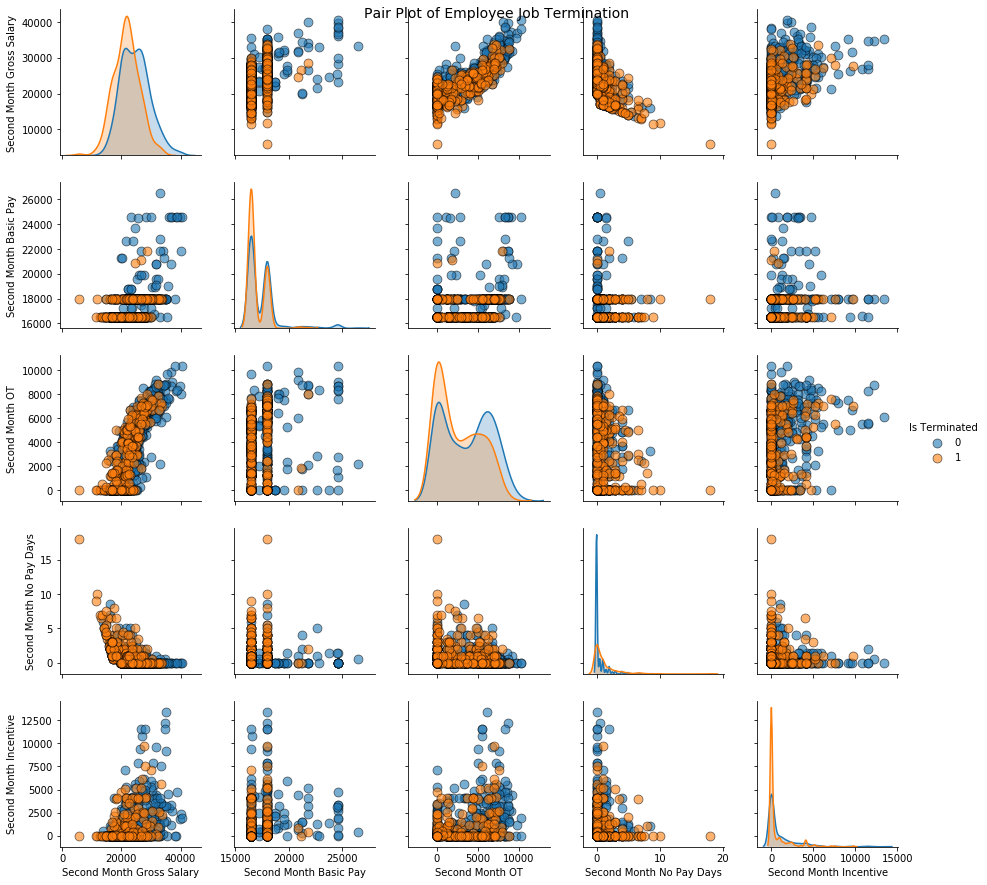
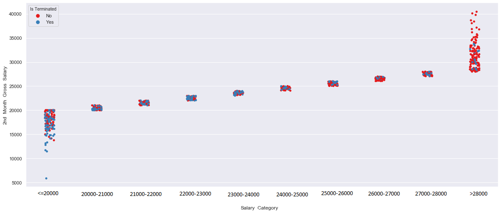

# CS5617 - Data Science Project 

#### Team : TEAM STARK

#### Team Members: SAMPATH THENNAKOON (209385G), AZEEM AMEEN (209309F)

#### Dataset : Appeal Manufacturing HR Data Set

#### Summary of sample data

|     | Gender              | PermanentResidence_cat| Residence             | CivilStatus_cat    | HighestEducationQualification_cat  |   ExtraCurricularActivities |   ApparelRelatedVocationalQualification |   PreviousJob |
|----:|:--------------------|:--------------------- |:----------------------|:-------------------|:----------------------------------:|----------------------------:|----------------------------------------:|--------------:|
|   0 | Female              | Yes                   | ComingFromHome        | Married            | PassedOL                           |     FALSE                   |       FALSE                             |    Apparel    |
|   1 | Female              | Yes                   | ComingFromHome        | Unmarried          | UptoOL                             |     TRUE                    |       FALSE                             |    Apparel    |
|   2 | Female              | Yes                   | ComingFromHome        | Married            | UptoOL                             |     FALSE                   |       FALSE                             |    Apparel    |

#### Distribution of some of the useful features

